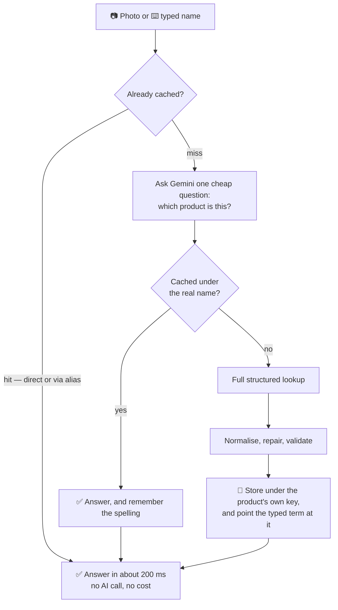
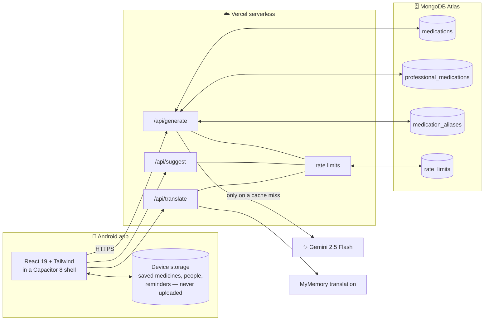

<div align="center">


# Medication Identifier

### Point a phone at a medicine box. Get a straight answer about what is inside it.

**In English or Arabic. Free. On Google Play.**

[](https://play.google.com/store/apps/details?id=com.danehab.medicationidentifier)
[](android/app/build.gradle)
[](android/variables.gradle)


</div>

> [!CAUTION]
> **This app is not medical advice.** Every answer is generated by an AI model and can be
> wrong, out of date, or incomplete. It exists to help someone *understand* a box they are
> already holding — never to decide whether to take something. Confirm with a pharmacist or
> a doctor. The app says this to the user too, on the first screen and under every answer.

---

## Table of contents

| | |
| --- | --- |
| [Why it exists](#why-it-exists) | The problem this solves |
| [What it does](#what-it-does) | Every feature, plainly |
| [How a lookup actually works](#how-a-lookup-actually-works) | Camera to answer, step by step |
| [The cache, and the bug that shaped it](#the-cache-and-the-bug-that-shaped-it) | Why it is keyed the way it is |
| [Keeping it safe and cheap](#keeping-it-safe-and-cheap) | Keys, limits, expiry |
| [Two languages, properly](#two-languages-properly) | Arabic is not a stylesheet flip |
| [One app, every Android phone](#one-app-every-android-phone) | Sizes, versions, themes |
| [Architecture](#architecture) | The map |
| [Project layout](#project-layout) | Where everything lives |
| [Getting started](#getting-started) | Run it in three commands |
| [Environment variables](#environment-variables) | What to set, and where |
| [Testing](#testing) | Three layers, and what each catches |
| [Building for Android](#building-for-android) | Debug and release |
| [Database maintenance](#database-maintenance) | The audit tool |
| [Documentation](#documentation) | The rest of the docs |

---

## Why it exists

Open any bathroom cabinet and you will find a strip of tablets in a box printed in a language
the owner does not read, with an ingredient name nobody recognises, and no leaflet — because
the leaflet went in the bin eighteen months ago.

The questions that follow are always the same four:

> *What is this for? How much do I take? Can I take it with food? What happens if it
> disagrees with me?*

Those answers exist. They are just buried in clinical prose, usually in one language, usually
behind a search engine that returns a pharmacy advert first.

**Medication Identifier answers them from a photograph of the box, in about two seconds.**

---

## What it does

### For anybody

| | Feature | What it means |
| :-: | --- | --- |
| 📷 | **Scan a box** | Camera, torch, and a still-frame capture. The name is read off the packaging by the model — not by OCR that trips on a glare. |
| ⌨️ | **Or just type it** | Type-ahead suggestions come out of the cache, so they cost nothing and appear instantly. Misspellings still land on the right medicine. |
| ✅ | **Confirm before committing** | *"Is this your box?"* — the app shows what it read and lets the user correct it before spending a lookup. |
| 💊 | **A readable answer** | What it is for, how to take it, food and drink, and when to call a doctor. Short sentences, real headings, one idea per line. |
| 🧴 | **A picture of the form** | Tablet, capsule, syrup, cream, drops, inhaler, injection, patch, suppository, spray, powder — eleven drawn forms plus a fallback, chosen from the answer itself. |
| ⚠️ | **Side effects, split three ways** | Common, *"call your doctor if"*, and *"stop and get help today"* — deduplicated, so the same symptom never appears twice with two different urgencies. |
| ⏰ | **Missed dose and storage** | Their own pages, with their own headings. Not one page behind three buttons. |
| 🩺 | **A professional view** | The same medicine for a clinician: indications, pharmacokinetics (ADME and half-life), chemistry, BCS class, adverse effects and interactions grouped by system. |
| 🔖 | **My medicines** | Save a medicine and it stays readable with no network at all. |
| 👥 | **People** | Keep separate lists for separate people — a parent, a child, yourself. |
| 🔔 | **Reminders** | Set times on a saved medicine and the phone notifies at them, even after a reboot. |
| 🔁 | **Duplicate-ingredient warning** | Two saved medicines that share an active ingredient get flagged, because that is exactly how somebody accidentally doubles a paracetamol dose. |
| 📤 | **Share and export** | Send an answer as text, or export a formatted report to PDF. The professional view exports the professional report, not the patient one. |
| 🌍 | **English and Arabic** | Full right-to-left layout, Arabic typography, and translated *content* — not just translated buttons. |
| 🌗 | **Light and dark** | Both themes are contrast-checked by an automated test, against what is actually painted behind each run of text. |
| 🧭 | **A guided tour** | Two tours — home and medicine page — with an animated hand that never covers the thing it is pointing at. Replayable from settings. |

### What it deliberately does **not** do

- **No accounts. No sign-up. No password.** Nothing to leak.
- **No personal medical data leaves the phone.** Saved medicines, people, and reminder times
  live in the device's own storage. The server never sees them.
- **No dose calculator.** It reports what a leaflet says; it will not do arithmetic on a
  person's weight and hand back a number.
- **No diagnosis.** It will not guess what is wrong with somebody from a list of symptoms.
- **No "is this safe for me?"** It shows the general warnings. The judgement stays with a
  human who knows the patient.

---

## How a lookup actually works



Three things are worth pointing out.

**1. The cheap question is asked first.** Resolving *"panadooll"* into *"paracetamol"* is a
tiny model call. If the answer is already cached under the real name, the expensive call never
happens — and the misspelling is remembered as an alias (about 120 bytes, against 2.5 KB for
an answer) so the next person who spells it that way skips even the cheap call.

**2. The model is asked for a shape, not for prose.** Every call sends a `responseSchema`, so
Gemini returns exactly the keys the UI reads, in a fixed order, with enumerated values
wherever there is a fixed set. There is no prompt-and-pray parsing step.

**3. Nothing is trusted on the way out.** Answers are normalised on *serve*, not only on save —
so a document written before a validation rule existed is still repaired before anyone reads
it. That is how a cached `86\nF)` became `86°F` for every user at once, with no migration.

---

## The cache, and the bug that shaped it

The first version of the cache keyed answers by **active ingredient**. It seemed obvious:
Panadol *is* paracetamol, so why store the same answer twice?

Then somebody searched for **Abimol** and the app showed them **Panadol**.

Both are paracetamol. Both were filed under `paracetamol`. The cache handed back whichever one
had been written first — a different brand, a different box, a different strength, with total
confidence. For a medication app that is the worst class of bug there is: **confidently wrong,
about the thing the user is holding.**

The fix runs through the whole storage layer.

| Rule | Where | What it prevents |
| --- | --- | --- |
| **The record decides its own key** | [`api/_cache.js`](api/_cache.js) | An answer filed under a name it does not match, because the key came from one model call and the contents from another. |
| **Key by product, not ingredient** | [`_cacheKey.js`](api/_cacheKey.js) → `storageKeyFor()` | Abimol and Panadol are two documents, because they are two boxes. |
| **An alias must be safe** | `aliasIsSafe()` | A single-ingredient search never points at a combination product. |
| **Age filter on every read** | `findCachedAnswer()` | Stale dosing or warnings are refused at read time, not merely expired in the background. |

There is a standing audit for all of it — see [Database maintenance](#database-maintenance).

---

## Keeping it safe and cheap

This is a free app with a paid AI backend behind it. Both halves of that sentence are
defended.

### The keys

> [!IMPORTANT]
> **No key ever reaches the device.** The Gemini key and the MongoDB connection string live
> only in Vercel's environment. The phone talks to `/api/*`; `/api/*` talks to Gemini. Taking
> the APK apart yields nothing — there is no key in the bundle to find.
>
> That is not left to good intentions. [`test/noSecretsInBundle.test.js`](test/noSecretsInBundle.test.js)
> reads the built output on every test run and fails if anything key-shaped is in it — a
> Google key, a MongoDB connection string, a private key block, a hard-coded bearer token, or
> a `VITE_*` variable whose name contains `KEY`, `SECRET`, `TOKEN`, `PASSWORD` or `URI`.

### The budget

| Guard | Default | Counts | Stops |
| --- | :-: | --- | --- |
| Per-caller, per minute — `generate` | 20 | every request, cached or not | one script hammering the endpoint |
| Per-caller, per minute — `translate` | 150 | every request | a flood, without locking out a normal Arabic page (about ten calls at once) |
| Per-caller, per minute — `suggest` | 120 | every request | abuse of type-ahead, which fires while somebody is still typing |
| Whole app, per day | 2000 | **only calls that reach Gemini** | a bad day costing real money |

Counters live in MongoDB rather than in memory. Serverless instances each keep their own
memory, so an in-memory counter is walked straight past by spreading requests across
instances.

Every failure path in the limiter **allows** the request. A rate limiter that breaks must
never take the app down with it.

### The expiry

Every cached answer, and every alias pointing at one, carries a **TTL index** — MongoDB
deletes it automatically 180 days after it was last written (`CACHE_MAX_AGE_DAYS`).

This matters more than it sounds. The six-month limit was always enforced *on read*: a stale
answer was refused and rewritten by the next person who wanted that medicine. But most
medicines are never looked up twice, so those rows simply stayed — the store only ever grew,
one document per medicine anybody had ever searched, misspellings included. Expiry costs
nothing, because a stale entry was going to be refetched anyway. The only difference is that
the row stops taking up space in between.

### CORS, honestly

`ALLOWED_ORIGINS` restricts which websites a *browser* will let call the API. It is a browser
courtesy and nothing more — it does not stop `curl`, a script, or anything that simply omits
an `Origin` header. **The rate limits are the real defence**, which is why they count every
request rather than only the ones that look legitimate.

---

## Two languages, properly

Arabic here is not a stylesheet flip.

- **The layout mirrors.** `dir="rtl"` plus Tailwind `rtl:` variants — padding, icons,
  chevrons, and the tour's pointing hand all change side.
- **The typography changes.** An Arabic face, and letter-spacing forced to zero, because
  tracking applied to Arabic breaks the joins between letters.
- **The content is translated, not just the chrome.** Switching language refetches the answer.
  An earlier build translated the headings and left the body in English; there is now a
  browser test that fails if that regresses.
- **Mixed text is isolated correctly.** A Latin brand name inside an Arabic sentence is
  wrapped in `<bdi>` — the name only, never the whole sentence, because `<bdi>` takes its
  direction from the first strong character and would flip an entire line.
- **Both blocks are checked for parity.** A unit test fails if either language is missing a key
  the other has. Currently 312 keys each, with no gaps and no strays.

---

## One app, every Android phone

The app runs on **Android 7.0 (API 24) and up**, compiled and targeted against **API 36**.
One build has to look right on a five-inch budget phone and on a tablet, so the tests measure
rather than assume:

- The guided-tour suite sweeps **seven viewport sizes × two tours × two languages × two
  themes** and checks, at every step, that the card is on screen, that the hand is not
  covering the thing it points at, and that nothing is measured mid-transition.
- The dark-mode suite walks every run of text on every screen and computes its contrast
  against **what is actually painted behind it** — not against the theme's nominal
  background.
- The device suite runs the same checks on a real Android WebView, including hardware-back
  behaviour, relaunch, and notification scheduling that survives a reboot.

---

## Architecture



**Total runtime dependencies: React, React DOM, and six Capacitor plugins.** No UI kit, no
state library, no HTTP client, no test framework. The browser tests drive a real Chrome over
the DevTools Protocol directly.

---

## Project layout

```
src/
  App.tsx                   routing, scroll restoration, language refetch
  components/               one file per screen, plus the tour and the icons
    CameraHome.tsx            the scan screen — camera, torch, shutter
    ConfirmScreen.tsx         "is this your box?"
    ResultScreen.tsx          the patient answer
    SideEffectsScreen.tsx     side effects / missed dose / storage
    ProfessionalScreen.tsx    the clinical view
    MyMedicinesScreen.tsx     saved list, people, reminders
    CoachMarks.tsx            the guided tour and its pointing hand
  lib/                      storage, reminders, export, dosage forms, i18n strings
  services/                 the three API clients
  context/                  language and theme

api/                        Vercel serverless functions (CommonJS)
  generate.js                 the lookup: cache → resolve → Gemini → normalise → store
  suggest.js                  type-ahead, served from the cache (no AI call)
  translate.js                English → Arabic
  _drugInfo.js                patient answer: schema, aliases, normalisation, prose repair
  _professional.js            clinical answer: the same treatment
  _identify.js                reading a name off a photograph
  _cache.js                   the answer cache, its alias table, and the TTL indexes
  _cacheKey.js                turning what was typed into a stable key
  _rateLimit.js               per-caller and whole-app limits
  _cors.js                    shared CORS handling
  db.js                       MongoDB helper (no-ops when unconfigured)

test/
  *.test.js                 unit tests — pure logic, no network
  browser/                  headless Chrome over CDP, against a local build
  device/                   the same screens on a real Android device
tools/dbAudit.mjs           live-database health check (read-only unless --fix)
android/                    the Capacitor Android project
public/                     app icon, intro video, privacy policy, terms
docs/                       release and security guides
```

---

## Getting started

```bash
npm install
```

Create your environment file and add a Gemini key — the free tier is plenty
([Google AI Studio](https://aistudio.google.com/app/apikey)):

```bash
cp .env.example .env.local
```

Then start it:

```bash
npm run dev
```

Open <http://localhost:3000>. The serverless functions in `api/` run **inside** the Vite dev
server, so the whole backend works without deploying anything.

> [!TIP]
> `MONGODB_URI` is optional. Leave it blank and the app still runs — every lookup just goes
> straight to Gemini, with no caching and no rate limiting.

---

## Environment variables

| Variable | Required | Purpose |
| --- | :-: | --- |
| `GEMINI_API_KEY` | **yes** | Server-side Gemini key. Never sent to the client. |
| `MONGODB_URI` | no | Enables the answer cache and the rate limiter. Omit to run without a database. |
| `ALLOWED_ORIGINS` | no | Comma-separated CORS allowlist. Unset means `*`. Browser-only protection — see [CORS, honestly](#cors-honestly). |
| `CACHE_MAX_AGE_DAYS` | no | How long an answer is reused, and the lifetime on the TTL indexes. Default `180`. |
| `RATE_LIMIT_GENERATE_PER_MINUTE` | no | Per-caller lookup allowance. Default `20`. |
| `RATE_LIMIT_TRANSLATE_PER_MINUTE` | no | Per-caller translation allowance. Default `150`. |
| `RATE_LIMIT_SUGGEST_PER_MINUTE` | no | Per-caller type-ahead allowance. Default `120`. |
| `RATE_LIMIT_PER_DAY` | no | Whole-app daily cap on calls that actually reach Gemini. Default `2000`. |
| `VITE_API_BASE_URL` | no | Overrides the backend URL. Blank means same-origin. |

Set them in the Vercel dashboard under **Settings → Environment Variables**, and locally in
`.env.local`, which is git-ignored.

---

## Testing

Three layers, fastest first. Each one catches something the layer below it cannot.

```bash
npm test               # logic, schemas, translations. Run this on every change.
npm run test:browser   # every screen in headless Chrome.
npm run test:device    # the same screens on a real Android device.
```

<details>
<summary><b>What each layer actually checks</b></summary>

### `npm test` — 221 tests

Runs the serverless functions against a **real in-memory MongoDB** with Gemini stubbed. It
covers cache keying, alias safety, prose repair, dosage-form detection, duplicate-ingredient
detection, reminder scheduling, side-effect deduplication, translation-key parity, and a
bundle-size ceiling.

### `npm run test:browser`

Drives the real app in headless Chrome over the Chrome DevTools Protocol — no Selenium, no
Playwright, no test framework. It needs a build being served:

```bash
npm run build && npm run preview
```

```bash
npm run test:browser
```

> [!WARNING]
> Make sure the preview server on `:4173` is serving **this** build. A preview left running
> from an earlier build will happily let the suite pass against code that no longer exists.

It checks what a screenshot cannot: that the answer comes before the reference material, that
Arabic is set in an Arabic face with no letter-spacing, that every run of text in dark mode has
contrast against what is actually painted behind it, that the tour's hand never covers its
target at any of seven viewport sizes, and that the scrim really does lock scrolling.

### `npm run test:device`

The same kind of checks against the app installed on an emulator or a phone, over an
adb-forwarded WebView debugger, and against the **live** backend. It costs real Gemini calls,
which is why it is a separate command. Build and install the debug APK first, and have `adb`
on `PATH`.

It adds what only a device can prove: hardware-back behaviour, relaunch and cold start,
notification scheduling that survives a reboot, and real scroll performance.

</details>

> [!NOTE]
> **A lesson worth keeping.** Most of the bugs that reached a user got through because a test
> measured the wrong thing — the reminders test proved `schedule:{at}` while the app shipped
> `on:{hour,minute}`; a tour check asked whether the *card* cleared the hand while the hand
> was sitting on the button; the Arabic suites asserted against pages that were never
> translated, because the harness had no `/api/translate` stub. When a test passes and the
> user still sees the bug, the test is the first thing to fix.

---

## Building for Android

```bash
npm run sync:android
```

```bash
npm run open:android
```

Release signing reads `android/keystore.properties`, which is git-ignored. Copy
`android/keystore.properties.example` and fill it in.

| | |
| --- | --- |
| Application ID | `com.danehab.medicationidentifier` |
| Minimum SDK | 24 — Android 7.0 Nougat |
| Compile / target SDK | 36 |
| Current version | `versionCode 9`, `versionName 1.5.0` |

> [!IMPORTANT]
> `versionCode` must increase for every Play Store upload. `versionName` in
> `android/app/build.gradle` should stay in step with `version` in `package.json`, because
> `__APP_VERSION__` is derived from the latter and decides whether a returning user is shown
> the guided tour again.

Full steps, including the signed bundle and the Play Console upload, are in
[docs/RELEASING.md](docs/RELEASING.md).

---

## Database maintenance

```bash
npm run audit:db
```

```bash
npm run audit:db -- --fix
```

The audit connects to the live database and checks that:

- every answer is filed under a key that matches its own contents;
- no alias points a single-ingredient search at a combination product;
- no alias is stray (pointing at a document that no longer exists) or shadowed (pointing at
  something the direct lookup would have found anyway);
- every answer collection and the alias table carry a TTL index at the configured lifetime.

Without `--fix` it changes nothing. With it, it drops and recreates a wrong TTL, removes
unsafe and stray aliases, and deletes misfiled documents — which is safe, because anything
deleted is simply refetched the next time somebody asks for it.

---

## Documentation

| Document | For |
| --- | --- |
| [GUIDE.md](GUIDE.md) | Every screen and every feature in plain language, with no code. Written for somebody deciding what the app should do, not how it is built. |
| [docs/RELEASING.md](docs/RELEASING.md) | Building, signing, and shipping a Play Store update. |
| [docs/SECURITY.md](docs/SECURITY.md) | Key handling, rotation, and what to do if something leaks. |
| [public/privacy-policy.html](public/privacy-policy.html) | The published privacy policy. |
| [public/terms-of-service.html](public/terms-of-service.html) | The published terms. |

---

<div align="center">

**Built by [DanEhab](https://play.google.com/store/apps/details?id=com.danehab.medicationidentifier)**

No open-source licence is granted — all rights reserved.

<sub>Medication Identifier helps somebody read a box. It does not practise medicine.</sub>

</div>
